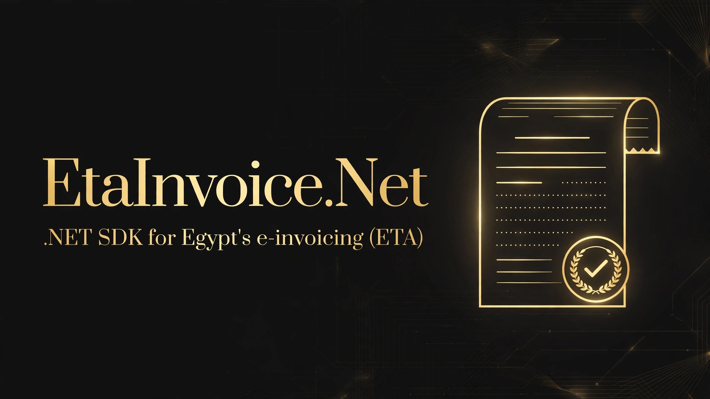

[](LICENSE)
[](https://dotnet.microsoft.com/)
[](https://github.com/SENESO/EtaInvoice.Net/actions/workflows/ci.yml)
[](https://github.com/SENESO/EtaInvoice.Net/stargazers)

# EtaInvoice.Net

A clean, modern .NET SDK for the **Egyptian Tax Authority (ETA) e-invoicing APIs** — submit signed e-invoices, track their validation status, cancel/reject documents, and search your document history.

> **Disclaimer:** community SDK, not affiliated with or endorsed by the Egyptian Tax Authority. API shapes follow the [official ETA SDK documentation](https://sdk.invoicing.eta.gov.eg/). Always verify against the official docs before production use.

## Install

```bash
dotnet add package EtaInvoice
```

Targets `netstandard2.0` and `net8.0`. Only dependency: `System.Text.Json` (+ DI abstractions).

## Quickstart

```csharp
using EtaInvoice;
using EtaInvoice.Models;

var client = new EtaClient(new EtaClientOptions
{
    ClientId = "<your-client-id>",       // from the ETA portal (register your ERP)
    ClientSecret = "<your-client-secret>",
    // BaseUrl/AuthUrl default to the preprod environment
});

var document = new EtaDocument
{
    Issuer = new Taxpayer
    {
        Type = TaxpayerTypes.Business,
        Id = "123456789",                 // tax registration number
        Name = "My Company",
        Address = new TaxpayerAddress
        {
            BranchId = "0",
            Country = "EG",
            Governate = "Cairo",
            RegionCity = "Nasr City",
            Street = "Main St",
            BuildingNumber = "10"
        }
    },
    Receiver = new Taxpayer
    {
        Type = TaxpayerTypes.Business,
        Id = "987654321",
        Name = "Buyer Co",
        Address = new TaxpayerAddress
        {
            Country = "EG", Governate = "Giza", RegionCity = "Dokki",
            Street = "Side St", BuildingNumber = "5"
        }
    },
    DocumentType = DocumentTypes.Invoice, // "i"
    DocumentTypeVersion = "1.0",
    DateTimeIssued = DateTime.UtcNow.ToString("yyyy-MM-ddTHH:mm:ssZ"),
    TaxpayerActivityCode = "1234",
    InternalId = "INV-2026-0001",
    InvoiceLines = new List<InvoiceLine>
    {
        new InvoiceLine
        {
            Description = "Consulting service",
            ItemType = "EGS",
            ItemCode = "EG-1234",
            UnitType = "EA",
            Quantity = 1,
            UnitValue = new UnitValue { CurrencySold = "EGP", AmountEGP = 1000m },
            SalesTotal = 1000m,
            Total = 1140m,
            TaxableItems = new List<TaxableItem>
            {
                new TaxableItem { TaxType = "T1", SubType = "V009", Amount = 140m, Rate = 14m }
            }
        }
    },
    TotalSalesAmount = 1000m,
    NetAmount = 1000m,
    TaxTotals = new List<TaxTotal> { new TaxTotal { TaxType = "T1", Amount = 140m } },
    TotalAmount = 1140m
};

// Optional: catch structural mistakes before the network call.
var problems = EtaInvoice.Validation.EtaDocumentValidator.Validate(document);

// Submit. Pass an IDocumentSigner to attach a CAdES-BES issuer signature
// (required in production — see "Signing" below).
var result = await client.SubmitDocumentsAsync(new[] { document }, signer: mySigner);

Console.WriteLine(result.SubmissionUuid);
foreach (var accepted in result.AcceptedDocuments)
    Console.WriteLine($"accepted: {accepted.InternalId} -> {accepted.Uuid}");
foreach (var rejected in result.RejectedDocuments)
    Console.WriteLine($"rejected: {rejected.InternalId}: {rejected.Error.Code}");
```

## ASP.NET Core DI

```csharp
services.AddEtaInvoice(options =>
{
    options.ClientId = builder.Configuration["Eta:ClientId"];
    options.ClientSecret = builder.Configuration["Eta:ClientSecret"];
});

// then inject EtaClient anywhere
```

## API reference

All methods target the `/api/v1.0/…` endpoints documented in the [official ETA SDK](https://sdk.invoicing.eta.gov.eg/einvoicingapi/).

| Method | Endpoint |
|---|---|
| `GetAccessTokenAsync()` | OAuth2 client-credentials (`/connect/token`, scope `InvoicingAPI`); token cached until expiry |
| `SubmitDocumentsAsync(documents, signer?)` | `POST /api/v1.0/documentsubmissions/` → 202 `{submissionUUID, acceptedDocuments, rejectedDocuments}` |
| `GetSubmissionAsync(uuid, pageNo?, pageSize?)` | `GET /api/v1.0/documentsubmissions/{uuid}` |
| `GetDocumentDetailsAsync(uuid)` | `GET /api/v1.0/documents/{uuid}/details` (status + validation results) |
| `GetDocumentRawAsync(uuid)` | `GET /api/v1.0/documents/{uuid}/raw` (source JSON + ETA metadata) |
| `GetDocumentPdfAsync(uuid)` | `GET /api/v1.0/documents/{uuid}/pdf` → `byte[]` |
| `CancelDocumentAsync(uuid, reason)` | `PUT /api/v1.0/documents/state/{uuid}/state` (`cancelled`) |
| `RejectDocumentAsync(uuid, reason)` | `PUT /api/v1.0/documents/state/{uuid}/state` (`rejected`) |
| `DeclineCancellationAsync(uuid)` | `PUT /api/v1.0/documents/state/{uuid}/decline/cancelation` |
| `SearchDocumentsAsync(query)` | `GET /api/v1.0/documents/search` (paged via `metadata.continuationToken`) |

Document types: `DocumentTypes.Invoice` (`i`), `CreditNote` (`c`), `DebitNote` (`d`), `ImportInvoice` (`ii`), `ExportInvoice` (`ei`), `ExportCreditNote` (`ec`), `ExportDebitNote` (`ed`).

Errors surface as `EtaApiException` with `StatusCode`, `ErrorCode` (e.g. `DuplicateSubmission`, `IncorrectSubmitter`) and the raw response body.

## Signing — read this before production

Real ETA signing requires your **eSeal certificate** (USB token / HSM / key vault) producing a **CAdES-BES** signature over the canonical document JSON. Private key material must never leave your infrastructure, so this SDK ships **no built-in signer** — instead:

1. Implement `IDocumentSigner` with your signing service (USB token middleware, HSM, cloud vault).
2. Pass it to `SubmitDocumentsAsync(documents, signer)` — the SDK canonicalizes each document (deterministic JSON: sorted keys, no whitespace, `signatures` section excluded, per ETA's "signed content is the entire document except the signature section" rule) and embeds the returned Base64 value as the issuer (`I`) signature.
3. **Verify the canonical string** against the official ETA "Signature Creation" documentation (or the official EInvoicingSigner tracing tool) before going live — canonicalization details are defined by ETA.

Submitting without a signer is fine for preprod experimentation; production ETA **rejects unsigned B2B documents**.

## Preprod vs production

Defaults point at **preprod** (`api.preprod.invoicing.eta.gov.eg`, `id.preprod.eta.gov.eg`). For production use `EtaClientOptions.Production(clientId, clientSecret)`.

## Scope & honesty

- ✅ Verified against the official ETA SDK docs (Oct 2026): auth, submit, submission status, document details/raw/PDF, cancel, reject, decline-cancellation, search.
- ⚠️ `IDocumentSigner` is an interface — you bring the real CAdES-BES signing (USB token/HSM). No fake crypto anywhere.
- ⚠️ Client-side validation (`EtaDocumentValidator`) catches structural mistakes only; ETA server-side validation is authoritative.
- Not covered (yet): EGS/GS1 code management APIs, document packages, notification callbacks, e-receipt (POS) APIs. Issues and PRs welcome.

## License

MIT — see [LICENSE](LICENSE).
